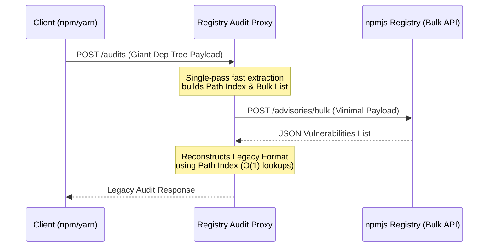

# 🚀 Registry Audit Proxy

A blazingly fast, heavily-optimized, memory-safe Rust proxy that dramatically improves the performance of legacy `npm audit` and `yarn audit` requests by bridging the gap to the new and highly-efficient npm Bulk Advisory API.

## ⚠️ The Problem

Older package managers (`yarn` v1, older `npm` versions) perform security audits by sending the **entire project dependency tree** to the registry. For large projects, this payload can easily exceed hundreds of megabytes.

* **Inefficiency:** It creates a huge bottleneck, sending an astronomical amount of irrelevant data over the wire.
* **Network & Memory Issues:** Large payloads cause memory spikes, parsing delays, or even fail midway (`ECONNRESET`, frequent timeouts).

The npm registry introduced a vastly superior new endpoint (`/-/npm/v1/security/advisories/bulk`), which simply accepts a flat list of dependencies and their versions. Unfortunately, legacy clients are hardcoded to the old endpoint (`/-/npm/v1/security/audits`) and cannot natively use the bulk API.

## 💡 The Solution

This **Registry Audit Proxy** is a high-performance MITM transparent proxy written in Rust. It does one thing perfectly:

1. It intercepts all outgoing `/audits` requests.
2. It parses the giant dependency tree in a **single, blazing-fast pass**, extracting a lightweight list of the packages and their versions mapped to their nested paths.
3. It forwards this tiny payload to the modern `/bulk` advisory API.
4. It receives the list of vulnerabilities and seamlessly **reconstructs** the heavy legacy audit response format.
5. All other normal registry requests are bypassed transparently.

Your local legacy build tools receive the exact format they expect but incredibly faster, reducing network bandwidth usage and solving timeout issues.

### Architecture



## 🛠️ Getting Started

### Prerequisites
* [Rust toolchain](https://rustup.rs/) configured and installed (`cargo`).

### Running the Proxy

Clone the repository and run it in release mode for maximum performance:

```bash
cargo run --release
```

The proxy will boot up rapidly and listen on port `4873` (by default). Optionally specify a custom PORT:
```bash
PORT=8080 cargo run --release
```

### Configuring Your Client

Configure `npm` or `yarn` to route requests through our lightning-fast proxy instead of the official registry:

**For npm:**
```bash
npm set registry http://localhost:4873
```

**For yarn:**
```bash
yarn config set registry http://localhost:4873
```

Now, run your audits like normal!

```bash
yarn audit
# OR
npm audit
```

## ⚡ Performance Details

This project doesn't merely translate the payloads; it guarantees zero overhead and flawless performance.

* **Single Pass Extraction Algorithm**: When mapping the dependency tree, the Rust implementation performs exactly one recursive descent, simultaneously extracting payloads, path data, and counters, drastically lowering cycles.
* **$O(1)$ Hash Map Path Resolution**: A pre-computed lookup map acts as a high-speed engine minimizing lookup complexity when findings are reconstructed for the final response.
* **Memory Safe & Highly Concurrent**: By utilizing `tokio` and hyper-efficient async runtimes along with strict compile-time borrow checking mechanisms, the proxy gracefully manages heavy concurrent audit load without panics or memory leaks.

## 🤝 Contributing

Contributions are extremely welcome, especially if you have ideas on making it even faster or finding ways to decrease latency further! Note that our goal is explicit simplicity and optimal algorithmic choices.

License: MIT
