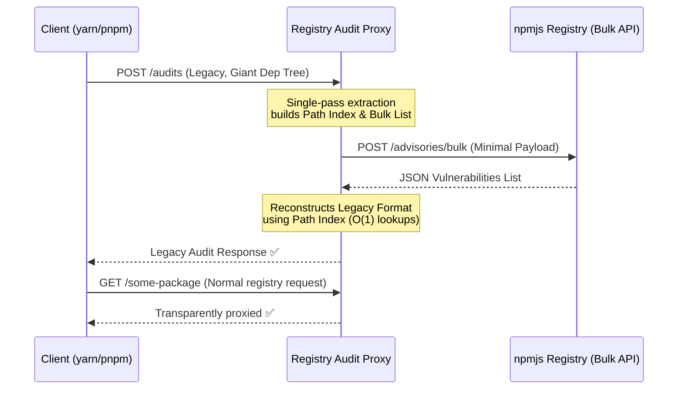

# 🚀 Registry Audit Proxy

A blazingly fast, memory-safe Rust proxy that fixes broken `yarn audit` and `pnpm audit` commands caused by the npm registry retiring its legacy security audit endpoints.

## ⚠️ The Problem

The npm registry **permanently retired** its legacy security audit endpoints in 2025, returning `HTTP 410 Gone` for all requests:

```
/-/npm/v1/security/audits
/-/npm/v1/security/audits/quick
```

> **Error message from the registry:**
> ```json
> {"error":"This endpoint is being retired. Use the bulk advisory endpoint instead. See the following docs for more info: https://api-docs.npmjs.com/#tag/Audit"}
> ```

This silently broke security auditing for millions of projects using legacy-compatible package managers:

- **Yarn Classic (v1.x)** — not receiving updates; hardcoded to the old endpoint. ([yarn#9234](https://github.com/yarnpkg/yarn/issues/9234))
- **pnpm v10.x and below** — uses the same retired endpoints. ([pnpm#11265](https://github.com/pnpm/pnpm/issues/11265))

The recommended fix from maintainers is to migrate to a newer package manager (`yarn berry`, `pnpm v11+`, etc.) — but that's often not a realistic short-term option for large, established projects.

## 💡 The Solution

This **Registry Audit Proxy** is a transparent MITM proxy that intercepts outgoing audit requests and seamlessly bridges them to the modern bulk advisory API — **without any changes to your existing workflow**.

1. Intercepts all outgoing `POST /audits` requests from Yarn/pnpm.
2. Parses the dependency tree in a **single, blazing-fast pass**, extracting a flat list of packages and versions.
3. Forwards this minimal payload to the modern `/-/npm/v1/security/advisories/bulk` endpoint.
4. Reconstructs the **exact legacy response format** that your tool expects.
5. All other registry requests (installs, metadata, etc.) are proxied transparently — untouched.

Your tools receive the exact format they expect, and auditing just works again.

### Architecture



---

## 🛠️ Getting Started

### Option 1: Run with Cargo (from source)

**Prerequisites:** [Rust toolchain](https://rustup.rs/) (`cargo`)

```bash
git clone https://github.com/kerolloz/registry-proxy.git
cd registry-proxy
cargo run --release
```

The proxy listens on port `4873` by default. To use a custom port:

```bash
PORT=8080 cargo run --release
```

---

### Option 2: Run with Docker

**Prerequisites:** [Docker](https://docs.docker.com/get-docker/)

**Build the image:**

```bash
docker build -t registry-audit-proxy .
```

**Run the container:**

```bash
docker run -p 4873:4873 registry-audit-proxy
```

To use a custom port:

```bash
docker run -p 8080:4873 -e PORT=4873 registry-audit-proxy
```

---

### Configuring Your Client

Point your package manager at the proxy instead of the official registry:

**For yarn:**
```bash
yarn config set registry http://localhost:4873
```

**For pnpm:**
```bash
pnpm config set registry http://localhost:4873
```

**For npm:**
```bash
npm config set registry http://localhost:4873
```

Now run your audits as usual — they will work again:

```bash
yarn audit
# OR
pnpm audit
# OR
npm audit
```

---

## ⚡ Performance

This proxy is engineered for zero overhead:

- **Single-Pass Extraction**: The dependency tree is traversed exactly once, simultaneously building the bulk payload and the path index map — no redundant passes.
- **O(1) Path Resolution**: A pre-computed `HashMap` allows instant lookups when reconstructing the legacy response from advisory results.
- **Async & Concurrent**: Built on `tokio` + `hyper`, the proxy handles many simultaneous audit connections without blocking or resource leaks.
- **Minimal Memory Footprint**: Only the lightweight flat package list is held in memory during the request cycle — not the full tree.

---

## 🤝 Contributing

Contributions are welcome! If you have ideas for improving performance, compatibility, or adding features (e.g., caching advisory results), feel free to open an issue or a PR.

---

## 📄 License

MIT
